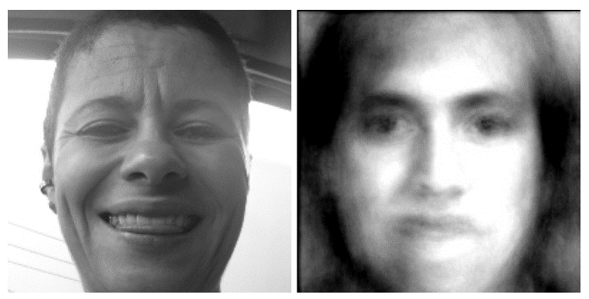
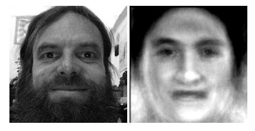
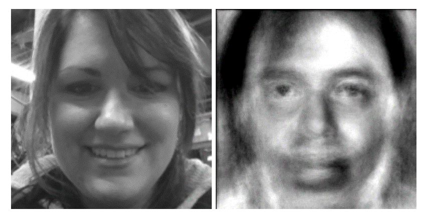

Face Recognition and the Face Field   

It might be worth tracing the road we have followed to get to our current set of questions. As follows:   

The terms Face Detection and Face Recognition are often used interchangeably but to be precise, Face Detection picks out faces from an image, whereas Face Recognition takes a new image of a face and matches it with one it has previously seen. Our research into multi-dimensional visual spaces draws upon algorithms used in Face Recognition.

Eigenfaces analysis is a statistical face recognition technique. It uses Principal Component Analysis to calculate a set of Eigenvectors, or Eigenfaces. These Eigenfaces can be thought of as 'face ingredients'. To calibrate the model, we calculated 60 Eigenfaces on a training set of over one thousand faces. Thereafter, whenever a new face is uploaded, it is subjected to a subspace projection that reconstitutes it as a linear combination of these Eigenfaces. Normally at this point, a face recognition algorithm would look for the closest match in this 60-dimensional Eigenface space. We are not interested in surveillance technologies but in exploring this 60-dimensional field of faces images.   

Our training engine was written in C# and C++. We modified the OpenCV code to allow us to extract the raw subspace coordinates and store them in a database. We also wrote a routine to reconstitute a face from the coordinates which turned out later to be a very interesting vein of inquiry:   

```
Mat Eigenfaces::reconstructFromCoordinates(InputArray coordinates) const {   
    Mat projection = coordinates.getMat();   
    // slice the eigenvectors from the model   
    Mat evs = Mat(_eigenvectors, Range::all(), Range(0, _num_components));  
    // do a subspace projection of the given coords, this will create our face. 
    Mat reconstruction = subspaceReconstruct(evs, _mean, projection);   
    return reconstruction.reshape(1,_faceRows);   
}   

```

Initially we explored the notion of a face continuum. How unique is one's own face? We asked the algorithm to do a sort:


From the face continuum emerged the notion of the Anti-Face. The Anti Face program is face recognition turned upside-down. After looking at your image, it creates a face as different from yours as possible. It might change your gender, your age, your expression. 

Stated mathematically:   


So prominent features in the reconstructed faces (with high weighting, meaning far from the mean) would be equally prominent, though opposite, in the anti-face.


We broadened the experiment by developing an <a href="https://itunes.apple.com/us/app/anti-face/id690376775">iPhone App</a> to allow everyone to view their anti-face. Here are some faces with their anti-faces:








A visit to the Art Institute of Chicago yielded beautiful contrasts:


Our system architecture looks like this:


